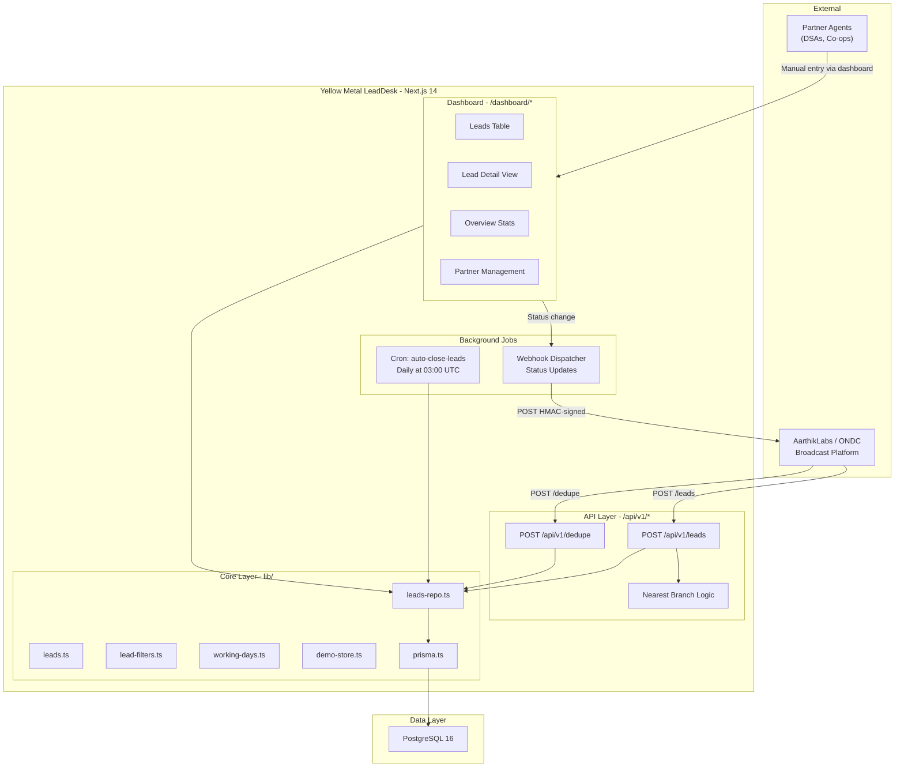
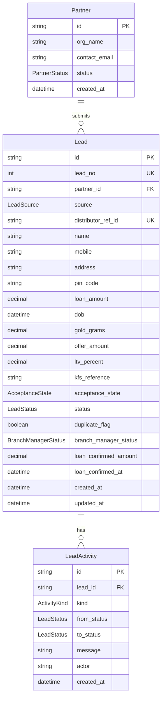
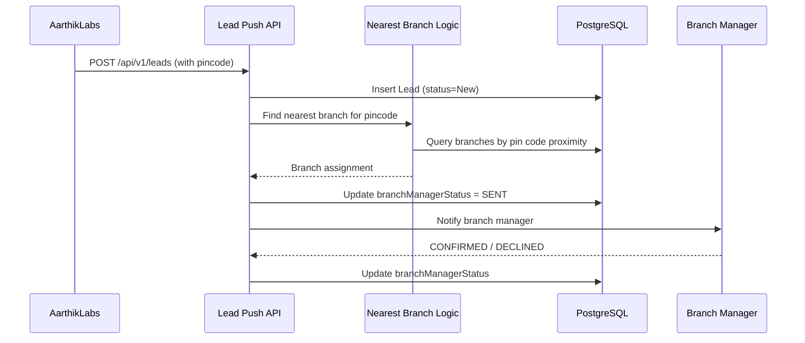
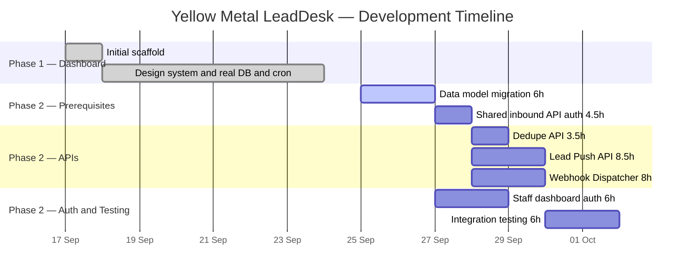

# Yellow Metal — LeadDesk Backend API Documentation

> **Project:** Yellow Metal LeadDesk  
> **Version:** 0.1.0  
> **Stack:** Next.js 14 (App Router) · Prisma ORM · PostgreSQL 16 · Vercel  
> **Authors:** Atharva Tayade, Ayushman Singh  
> **Last updated:** 24 September 2026

---

## Table of Contents

1. [How It All Started](#1-how-it-all-started)
2. [Architecture Overview](#2-architecture-overview)
3. [Data Model & Schema Evolution](#3-data-model--schema-evolution)
4. [Backend API §1 — Dedupe](#4-backend-api-1--dedupe)
5. [Backend API §2 — Lead Push](#5-backend-api-2--lead-push)
6. [Backend API §3 — Nearest Branch](#6-backend-api-3--nearest-branch)
7. [Backend API §4 — Webhook (Status Dispatcher)](#7-backend-api-4--webhook-status-dispatcher)
8. [Supporting Infrastructure](#8-supporting-infrastructure)
9. [Security Model](#9-security-model)
10. [Deployment & Operations](#10-deployment--operations)
11. [Project Timeline](#11-project-timeline)
12. [File Index](#12-file-index)

---

## 1. How It All Started

### The Origin Story

Yellow Metal is a **gold-loan lead management system (LMS)** built for a gold-finance company operating across South India. The core problem was straightforward: leads were pouring in from two completely separate channels — **local referral partners** (agents, DSAs, co-ops) and a **national digital distribution network via AarthikLabs / ONDC** — and there was no single system to receive, deduplicate, track, and act on them.

### Phase 1 — The Admin Dashboard (Shipped)

The project began on **17 September 2026** with an initial commit:

```
2ae3f84  Initial LeadDesk frontend scaffold  (17 Sep 2026)
```

Phase 1 focused exclusively on the **admin dashboard** — a Next.js 14 App Router application that lets branch staff:

- View all incoming leads in a filterable, sortable table
- See lead details, activity history, and duplicate flags
- Change lead status (`New` → `Contacted` → `Converted` / `Rejected`)
- Track partner performance and overview statistics
- Operate in **demo mode** (in-memory data, no database required) for frontend development

By **24 September 2026**, the second commit landed:

```
ca3f69b  Sync backup with current LeadDesk: design system, real DB, lead-timeout  (24 Sep 2026)
```

This brought the Yellow Metal LMS design system (Manrope font, brand color tokens, custom spacing), real PostgreSQL connectivity, loading skeletons, and the **auto-close-leads cron** — a Vercel-scheduled job that rejects stale leads after 7 working days of inaction.

### Phase 2 — The Backend APIs (Planned & In Progress)

With the dashboard stable, the team shifted to the **three AarthikLabs integration APIs** documented in [feature-aarthiklabs-apis-1.md](file:///c:/Users/athar/Downloads/yellowmetal/plan/feature-aarthiklabs-apis-1.md). These APIs turn the dashboard from an internal-only tool into a **bidirectional integration point** with AarthikLabs' ONDC broadcast system:

| # | API | Direction | Purpose |
|---|-----|-----------|---------|
| 1 | **Dedupe** | Inbound | Check if a mobile number already exists before broadcasting |
| 2 | **Lead Push** | Inbound | Accept full borrower + offer payload from AarthikLabs |
| 3 | **Nearest Branch** | Internal | Route leads to the geographically closest branch |
| 4 | **Webhook** | Outbound | Push status updates back to AarthikLabs on every state change |

> [!IMPORTANT]
> The project follows a deliberate "APIs + Dashboard are one system" constraint — no separate microservice. The [Production Build Plan](file:///c:/Users/athar/Downloads/yellowmetal/plan/feature-aarthiklabs-apis-1.md#L124) explicitly warns against splitting into "two builds bolted together."

> [!CAUTION]
> **Unresolved overlap, not yet a decision:** a separate Express service — `yellow_metal_ondc/backend` — already implements all four of these APIs (Dedupe, Lead Creation, Nearest Branch, Lead Status/webhook), already hardened (API-key auth, rate limiting, webhook retry, pagination) and audited against AarthikLabs' real spec doc. The Phase 2 plan referenced above (and its ALT-001 entry) doesn't mention that backend and reads as if these APIs don't exist anywhere yet. Building the four APIs in §4–§7 as new LeadDesk-native routes would duplicate that work. This needs a team decision — which backend is the real one — before Phase 2 build work starts; this document does not make that call.

---

## 2. Architecture Overview



### Key Design Decisions

| Decision | Choice | Rationale |
|----------|--------|-----------|
| Framework | Next.js 14 App Router | 100% fit per fullstack decision engine (V3 §3) — SSR, API routes, single deploy |
| ORM | Prisma 6.19.3 | Type-safe queries, migration management, seed scripts |
| Database | PostgreSQL 16 | Relational integrity for lead lifecycle, `DECIMAL` precision for financial amounts |
| Hosting | Vercel | Native Next.js support, Cron Jobs, environment management |
| Auth (API) | Static API key | Sufficient at ~5 QPS year-one traffic; JWT deferred (ALT-003) |
| Auth (Dashboard) | `iron-session` | Planned for Phase 6; currently unauthenticated (SEC-003 gap) |

---

## 3. Data Model & Schema Evolution

### Core Schema

The data model is defined in [schema.prisma](file:///c:/Users/athar/Downloads/yellowmetal/prisma/schema.prisma) and was established in the initial migration ([migration.sql](file:///c:/Users/athar/Downloads/yellowmetal/prisma/migrations/20260918104014_phase1_leads_partners_activity/migration.sql)).

#### Entity Relationship Diagram



#### Enums

| Enum | Values | Purpose |
|------|--------|---------|
| `LeadStatus` | `New`, `Contacted`, `Converted`, `Rejected` | Lead lifecycle states |
| `LeadSource` | `PARTNER`, `AARTHIKLABS` | Origin channel of the lead |
| `AcceptanceState` | `NA`, `ACCEPTED`, `EXPIRED_UNACCEPTED` | KFS offer acceptance tracking |
| `BranchManagerStatus` | `NOT_SENT`, `SENT`, `CONFIRMED`, `DECLINED` | Branch manager notification state |
| `PartnerStatus` | `invited`, `active`, `disabled` | Partner onboarding state |
| `ActivityKind` | `SUBMITTED`, `STATUS_CHANGED` | Audit trail event types |

#### Indexes

The schema carries **11 indexes** for query performance:

| Table | Index | Type |
|-------|-------|------|
| `leads` | `mobile` | B-tree (dedupe lookups) |
| `leads` | `pin_code` | B-tree (nearest branch queries) |
| `leads` | `loan_amount` | B-tree (filter range queries) |
| `leads` | `offer_amount` | B-tree (filter range queries) |
| `leads` | `created_at` | B-tree (time-range filters, stale-lead scan) |
| `leads` | `status` | B-tree (status filters, dashboard counts) |
| `leads` | `source` | B-tree (channel-based filtering) |
| `leads` | `partner_id` | B-tree (partner-scoped queries) |
| `leads` | `lead_no` | Unique (human-readable `YM-XXXX` references) |
| `lead_activities` | `(lead_id, created_at)` | Composite (activity timeline for a lead) |
| `partners` | `contact_email` | B-tree (partner lookup by email) — omitted from earlier count |

### Planned Schema Changes (Phase 2)

Per [TASK-001](file:///c:/Users/athar/Downloads/yellowmetal/plan/feature-aarthiklabs-apis-1.md#L39), the following fields are being added to `Lead`:

- `distributorRefId` — Already added (unique constraint, used by ONDC sync)
- `consentRefId` — Pending
- `interestRatePct` — Pending
- `tenureMonths` — Pending
- `offerId` — Pending
- `officerName` — Pending
- `officerContact` — Pending
- `statusReason` — Pending

> [!NOTE]
> A `LeadStatus` enum unification is pending sign-off (DEP-003): `Converted` to `Disbursed`, plus adding `BranchVisitScheduled`. This is the **critical path blocker** for all Phase 2 work.

---

## 4. Backend API §1 — Dedupe

### Purpose

The Dedupe API allows AarthikLabs to check whether a borrower's mobile number already exists in Yellow Metal's system **before broadcasting** a loan offer. This is strictly **informational** — a duplicate hit never rejects or delays the broadcast response.

### Endpoint Contract

```
POST /api/v1/dedupe
```

**Request:**
```json
{
  "mobile_number": "9741023458"
}
```

**Response (duplicate found):**
```json
{
  "is_duplicate": true,
  "existing_lead_id": "clxyz...",
  "existing_status": "Contacted",
  "last_submitted_at": "2026-09-16T09:12:00.000Z"
}
```

**Response (no duplicate):**
```json
{
  "is_duplicate": false,
  "existing_lead_id": null,
  "existing_status": null,
  "last_submitted_at": null
}
```

### How It Works Internally

The dedupe logic already exists in the codebase in two places:

1. **[leads-repo.ts - getLeadDetail()](file:///c:/Users/athar/Downloads/yellowmetal/lib/leads-repo.ts#L126-L130)** — queries `leads` by `mobile` to find duplicates for the detail view
2. **[leads.ts - duplicatesOf()](file:///c:/Users/athar/Downloads/yellowmetal/lib/leads.ts#L154-L156)** — client-side duplicate matching by mobile number

The API endpoint at `app/api/v1/dedupe/route.ts` will:

1. Validate the request body with a **Zod schema** (`{ mobile_number: string }`)
2. Query the `leads` table using the `mobile` index: `WHERE mobile = $1`
3. Return the duplicate flag, existing lead reference, status, and last submission date
4. **Never block** — the query is a single indexed lookup, expected sub-10ms

### Design Guardrail

> **GUD-001:** Dedupe is informational only; a duplicate hit must never reject or delay a broadcast response.

This means the endpoint returns `200 OK` in all cases — the response body communicates whether a duplicate was found, not the HTTP status code.

### Matching Logic

Currently: **mobile-number-only** matching. DEP-002 (pending AarthikLabs confirmation) may expand this to include DOB + name fuzzy matching, but the API contract shape remains the same.

### Test Matrix

| Scenario | Expected Outcome |
|----------|-----------------|
| Mobile exists in `leads` table | `is_duplicate: true` with lead reference |
| Mobile does not exist | `is_duplicate: false`, null fields |
| Malformed / missing `mobile_number` | `400` with Zod validation errors |
| Missing API key | `401 Unauthorized` |

---

## 5. Backend API §2 — Lead Push

### Purpose

The Lead Push API is the primary integration point — it accepts the **full borrower + offer payload** from AarthikLabs after a successful ONDC broadcast and inserts it as a new lead into Yellow Metal's system.

### Endpoint Contract

```
POST /api/v1/leads
```

**Request:**
```json
{
  "distributor_ref_id": "AL-2026-000456",
  "borrower": {
    "name": "Divya Reddy",
    "mobile_number": "9740098123",
    "address": "Plot 22, Hitech City, Hyderabad",
    "pincode": "500081",
    "dob": "1991-03-14"
  },
  "offer_accepted": {
    "gold_weight_grams": 42.5,
    "offer_amount": 210000,
    "ltv_percent": 72.0,
    "kfs_reference": "KFS-2026-09-000318",
    "interest_rate_pct": 12.5,
    "tenure_months": 12,
    "offer_id": "OFF-2026-09-000318"
  }
}
```

**Response:**
```json
{
  "lead_id": "clxyz...",
  "lead_no": 1042,
  "status": "New",
  "acknowledged_at": "2026-09-24T11:30:00.000Z"
}
```

### How It Works Internally

The Lead Push endpoint builds on the existing data access patterns established in Phase 1:

1. **Validate** the nested payload with a Zod schema (borrower + offer blocks)
2. **Map** the AarthikLabs field names to the Prisma model (snake_case to camelCase)
3. **Insert** a new `Lead` row with:
   - `source = AARTHIKLABS`
   - `status = New`
   - `acceptanceState = ACCEPTED` (since KFS was accepted)
   - `duplicateFlag` set based on mobile-number match
4. **Create** a `LeadActivity` entry: `"Lead submitted by AarthikLabs / ONDC"`
5. **Return** `{ lead_id, lead_no, status, acknowledged_at }`

### Idempotency

Leads are keyed on `distributor_ref_id` (unique constraint in the schema — see [schema.prisma L63](file:///c:/Users/athar/Downloads/yellowmetal/prisma/schema.prisma#L63)). Re-submitting the same `distributor_ref_id` will be handled via upsert logic, ensuring no duplicate lead creation.

The ONDC sync script ([sync-ondc-leads.ts](file:///c:/Users/athar/Downloads/yellowmetal/scripts/sync-ondc-leads.ts)) already demonstrates this pattern:

```typescript
await prisma.lead.upsert({
  where: { distributorRefId: lead.distributor_ref_id },
  create: { /* full lead data */ },
  update: { /* updated fields */ },
});
```

### Duplicate Flagging

When a lead arrives, the system checks `leads.mobile` for existing records. If a match is found:
- `duplicate_flag = true` is set on the new lead
- The lead is **still accepted** (not rejected) — duplicate detection is informational

### Auto-Close Integration

Once a lead is pushed, it enters the **7-working-day timeout window**. The [auto-close-leads cron](file:///c:/Users/athar/Downloads/yellowmetal/app/api/cron/auto-close-leads/route.ts) runs daily at 03:00 UTC and rejects any lead stuck in `New` or `Contacted` for 7 or more working days:

```typescript
// lib/leads-repo.ts — closeStaleLeads()
if (workingDaysSince(lead.createdAt) < LEAD_TIMEOUT_WORKING_DAYS) continue;
```

### Test Matrix

| Scenario | Expected Outcome |
|----------|-----------------|
| Valid full payload | `201 Created` with `lead_id`, `lead_no` |
| Duplicate `distributor_ref_id` | Idempotent upsert, same `lead_id` returned |
| Duplicate mobile number | Lead accepted with `duplicate_flag: true` |
| Malformed nested payload | `400` with Zod validation errors |
| Missing required fields | `400` with field-level errors |
| Missing API key | `401 Unauthorized` |

---

## 6. Backend API §3 — Nearest Branch

### Purpose

The Nearest Branch logic determines which Yellow Metal branch a lead should be routed to based on the borrower's **pin code**. This is not a standalone public endpoint — it is an internal routing function invoked during lead push processing to assign leads to the closest branch for follow-up.

### How Routing Works

The system uses **pin code** as the primary geographic signal. The `leads` table carries a `pin_code` field (indexed — see [schema.prisma L67](file:///c:/Users/athar/Downloads/yellowmetal/prisma/schema.prisma#L67) and the [pin_code index](file:///c:/Users/athar/Downloads/yellowmetal/prisma/migrations/20260918104014_phase1_leads_partners_activity/migration.sql#L82)) which maps to Indian postal codes.

#### Current Implementation

The pin code is stored and indexed for every lead. The dashboard already supports **pin code filtering** via the [lead-filters.ts](file:///c:/Users/athar/Downloads/yellowmetal/lib/lead-filters.ts#L76) module:

```typescript
if (pin && !lead.pinCode.includes(pin)) return false;
```

#### Actually Implemented (`yellow_metal_ondc/backend`, not this repo)

Real pincode-based routing already exists and is live in the separate Express backend, not as speculative "proximity" routing but as an **exact-match lookup against a static branch directory** — matching the AarthikLabs PDF's own wording, "run pincode serviceability check as per Yellow Metal rules" (a business-rule assignment, not GPS distance):

```typescript
// backend/src/data/branches.ts
export interface Branch {
  branch_id: string;
  branch_name: string;
  branch_address: string;
  contact_person_name: string;
  contact_person_mobile: string;
  serviceable_pincodes: string[];  // exact PINs this branch covers
}

export const BRANCHES: Branch[] = [ /* one entry per branch */ ];
```

```typescript
// backend/src/services/branch.service.ts
export class BranchService {
  static findBranchForPincode(pincode: string): Branch | null {
    return BRANCHES.find((b) => b.serviceable_pincodes.includes(pincode)) ?? null;
  }
}
```

[`handleNearestBranch`](file:///C:/Users/athar/Documents/yellow_metal_ondc/backend/src/controllers/aarthiklabs.controller.ts) (`POST /api/v1/branch`) calls this and now returns `{ serviceable: false }` for an unmatched pincode — the previous version of this endpoint was a hardcoded stub that always returned the same branch regardless of input. It's currently seeded with one placeholder branch; swapping in Yellow Metal's real branch list (pending from Rahul) is a data change in `branches.ts`, not a logic change. Known limitation: if a pincode ever appears in two branches' lists, the first match in the array wins — no conflict resolution is built.

#### Planned Branch Manager Integration

The schema already carries the `BranchManagerStatus` enum and field (`NOT_SENT` to `SENT` to `CONFIRMED` / `DECLINED`), indicating that branch-level routing is a first-class concept:

| Status | Meaning |
|--------|---------|
| `NOT_SENT` | Lead received, branch manager not yet notified |
| `SENT` | Notification sent to nearest branch manager |
| `CONFIRMED` | Branch manager accepted the lead |
| `DECLINED` | Branch manager declined — may re-route to next closest branch |

### Architecture of the Routing Flow



### Key Points

- **Geographic precision:** Indian pin codes map to post offices (over 155,000 unique codes), providing locality-level routing without full GPS coordinates
- **Fallback behavior:** If no branch is within the pin code's region, the lead stays at `branchManagerStatus = NOT_SENT` for manual assignment
- **Filter support:** The dashboard already allows staff to filter leads by pin code, making branch-level views immediately available

---

## 7. Backend API §4 — Webhook (Status Dispatcher)

### Purpose

The Webhook dispatcher is an **outbound integration** — whenever a lead's status changes within Yellow Metal's dashboard, a signed HTTP POST is sent to AarthikLabs' webhook receiver URL so they can update their own systems in real time.

### Trigger Point

> [!NOTE]
> **Not built yet.** The real `updateLeadStatus` server action in [actions.ts](file:///c:/Users/athar/Downloads/yellowmetal/app/dashboard/actions.ts) today is 19 lines: validate status, call `updateLeadStatusRepo`, revalidate three dashboard paths. No webhook dispatch call exists in it. The snippet below is the **planned** shape (TASK-017 in the Phase 2 plan), not current code.

```typescript
"use server";

export async function updateLeadStatus(id: string, status: LeadStatus) {
  // Validate status
  // Update in DB (via leads-repo.ts)
  // >>> WEBHOOK DISPATCH WOULD GO HERE (not implemented) <<<
  // Revalidate dashboard paths
}
```

The status update itself is already transactional — see [leads-repo.ts L287-L304](file:///c:/Users/athar/Downloads/yellowmetal/lib/leads-repo.ts#L287-L304):

```typescript
await prisma.$transaction(async (tx) => {
  const current = await tx.lead.findUniqueOrThrow({ where: { id } });
  if (current.status === status) return;  // no-op if unchanged

  await tx.lead.update({ where: { id }, data: { status } });
  await tx.leadActivity.create({
    data: {
      leadId: id,
      kind: "STATUS_CHANGED",
      fromStatus: current.status,
      toStatus: status,
      message: `Status changed ${current.status} -> ${status}`,
    },
  });
});
```

### Webhook Payload

```json
{
  "event_id": "evt_clxyz123",
  "event_type": "lead.status_changed",
  "timestamp": "2026-09-24T11:35:00.000Z",
  "data": {
    "lead_id": "clxyz...",
    "distributor_ref_id": "AL-2026-000456",
    "from_status": "New",
    "to_status": "Contacted",
    "changed_at": "2026-09-24T11:35:00.000Z"
  }
}
```

### Security — HMAC-SHA256 Signing

Every outbound webhook request is signed per **SEC-002**:

1. Compute `HMAC-SHA256` of the raw JSON body using a shared secret
2. Attach the signature in the `X-Signature-256` header
3. AarthikLabs verifies using `crypto.timingSafeEqual` (constant-time comparison to prevent timing attacks)

The codebase already demonstrates `timingSafeEqual` usage in the [auto-close-leads cron route](file:///c:/Users/athar/Downloads/yellowmetal/app/api/cron/auto-close-leads/route.ts#L5-L13):

```typescript
function safeCompare(a: string, b: string): boolean {
  const bufA = Buffer.from(a);
  const bufB = Buffer.from(b);
  if (bufA.length !== bufB.length) {
    timingSafeEqual(bufA, bufA);  // constant-time even on length mismatch
    return false;
  }
  return timingSafeEqual(bufA, bufB);
}
```

### Retry & Failure Handling

| Attempt | Delay | Action |
|---------|-------|--------|
| 1st | Immediate | Fire webhook |
| 2nd | 5 seconds | Exponential backoff retry |
| 3rd | 30 seconds | Final retry |
| Failure | — | Log to `LeadActivity` as a system event, alert ops |

### Idempotency

Each webhook carries a unique `event_id`. AarthikLabs can deduplicate based on this ID to handle cases where a retry delivers the same event twice.

### Test Matrix

| Scenario | Expected Outcome |
|----------|-----------------|
| Status change `New` to `Contacted` | Webhook fires with correct payload |
| Status unchanged (no-op) | No webhook fired |
| Valid HMAC signature | Verification passes on receiver |
| Invalid HMAC signature | Receiver rejects the payload |
| Webhook delivery failure | Retry with backoff, log on final failure |
| Duplicate `event_id` | Receiver deduplicates |

---

## 8. Supporting Infrastructure

### Auto-Close Leads Cron

**File:** [route.ts](file:///c:/Users/athar/Downloads/yellowmetal/app/api/cron/auto-close-leads/route.ts)  
**Schedule:** Daily at 03:00 UTC ([vercel.json](file:///c:/Users/athar/Downloads/yellowmetal/vercel.json))  
**Logic:** [closeStaleLeads()](file:///c:/Users/athar/Downloads/yellowmetal/lib/leads-repo.ts#L312-L342)

Scans all leads in `New` or `Contacted` status, calculates working days (Mon-Fri, no holiday calendar) since creation, and rejects any lead that has sat idle for 7 or more working days. Each closure creates a `LeadActivity` record with `actor: "system:lead-timeout"`.

### ONDC Sync Script

**File:** [sync-ondc-leads.ts](file:///c:/Users/athar/Downloads/yellowmetal/scripts/sync-ondc-leads.ts)

A one-off/manual migration script that pulls leads from the separate `yellow_metal_ondc` backend and upserts them into LeadDesk, keyed on `distributorRefId`. This was the **bridge** between the old ONDC backend and the new unified LeadDesk system before the real-time Lead Push API was built.

```bash
npx tsx scripts/sync-ondc-leads.ts http://localhost:8080
```

### Demo Mode

**File:** [demo-store.ts](file:///c:/Users/athar/Downloads/yellowmetal/lib/demo-store.ts)

When `LEADDESK_DEMO=1` or `DATABASE_URL` is unset, the entire system runs on in-memory example data. This was critical for Phase 1 frontend development — designers and frontend engineers could iterate without needing a PostgreSQL instance.

---

## 9. Security Model

### Inbound API Authentication (SEC-001) — Planned, Not Built

> [!NOTE]
> `app/api/` currently contains only `cron/`. No `/api/v1/*` directory, no API-key check, and no rate limiting exist in this repo yet — the table below is the Phase 2 target design (TASK list, SEC-001), not current state.

| Layer | Mechanism | Scope |
|-------|-----------|-------|
| API Key | `Authorization: Bearer <key>` header | All `/api/v1/*` routes (planned) |
| Rate Limiting | In-memory token-bucket | Shared across Dedupe + Lead Push (planned) |
| Validation | Zod schemas | Per-endpoint request body validation (planned) |

`AARTHIKLABS_API_KEY` is not yet in `.env.example` or referenced in code — it will be, once these routes are built.

### Outbound Webhook Signing (SEC-002)

- **Algorithm:** HMAC-SHA256
- **Signed over:** Raw JSON body
- **Verification:** `crypto.timingSafeEqual` (constant-time comparison)
- **Idempotency:** Unique `event_id` per webhook event

### Dashboard Authentication (SEC-003 — Planned)

> [!WARNING]
> The admin dashboard is **currently unauthenticated**. This is tracked as a Critical-severity gap (DREAD score 8.2). Phase 6 of the implementation plan adds `iron-session`-based authentication before real lead data is stored.

### Cron Authentication

The auto-close-leads cron endpoint verifies the `Authorization` header against `CRON_SECRET` using constant-time comparison — see [route.ts L15-L21](file:///c:/Users/athar/Downloads/yellowmetal/app/api/cron/auto-close-leads/route.ts#L15-L21).

---

## 10. Deployment & Operations

### Local Development

```bash
# 1. Start PostgreSQL
npm run db:up          # docker compose up -d (Postgres 16 on port 5433)

# 2. Run migrations
npm run db:migrate     # prisma migrate dev

# 3. Seed example data
npm run db:seed        # tsx prisma/seed.ts

# 4. Start dev server
npm run dev            # next dev
```

### Environment Variables

| Variable | Required | Description |
|----------|----------|-------------|
| `DATABASE_URL` | Yes (prod) | PostgreSQL connection string |
| `LEADDESK_DEMO` | No | Set to `1` for in-memory demo mode |
| `CRON_SECRET` | Yes (prod) | Bearer token for cron endpoint auth |
| `AARTHIKLABS_API_KEY` | Yes (Phase 2) | API key for inbound AarthikLabs requests |

### Vercel Production

- **Framework:** Auto-detected as Next.js
- **Cron Jobs:** Configured in [vercel.json](file:///c:/Users/athar/Downloads/yellowmetal/vercel.json) — `auto-close-leads` at `0 3 * * *`
- **Build:** `next build` with `prisma generate` on `postinstall`

---

## 11. Project Timeline



### Effort Summary

| Scope | Hours | Working Days (2 engineers) |
|-------|-------|---------------------------|
| The 3 APIs only (Dedupe + Lead Push + Webhook) | 20h | ~1.5-2 days |
| + Blocking prerequisites (schema, API auth, staff auth) | 36.5h | ~2.5-3 days |
| + Integration testing | 42.5h | ~3-3.5 days |

---

## 12. File Index

| File | Purpose |
|------|---------|
| [schema.prisma](file:///c:/Users/athar/Downloads/yellowmetal/prisma/schema.prisma) | Data model: Lead, Partner, LeadActivity + all enums |
| [migration.sql](file:///c:/Users/athar/Downloads/yellowmetal/prisma/migrations/20260918104014_phase1_leads_partners_activity/migration.sql) | Initial migration: tables, indexes, foreign keys |
| [seed.ts](file:///c:/Users/athar/Downloads/yellowmetal/prisma/seed.ts) | Database seeding with example partners and leads |
| [leads.ts](file:///c:/Users/athar/Downloads/yellowmetal/lib/leads.ts) | Type definitions, constants, formatters, example data |
| [leads-repo.ts](file:///c:/Users/athar/Downloads/yellowmetal/lib/leads-repo.ts) | Data access layer: CRUD, overview stats, auto-close |
| [lead-filters.ts](file:///c:/Users/athar/Downloads/yellowmetal/lib/lead-filters.ts) | Client-side filter logic for the leads table |
| [working-days.ts](file:///c:/Users/athar/Downloads/yellowmetal/lib/working-days.ts) | Mon-Fri day counter for lead timeout calculation |
| [demo-store.ts](file:///c:/Users/athar/Downloads/yellowmetal/lib/demo-store.ts) | In-memory store for demo/no-DB mode |
| [prisma.ts](file:///c:/Users/athar/Downloads/yellowmetal/lib/prisma.ts) | Prisma client singleton |
| [actions.ts](file:///c:/Users/athar/Downloads/yellowmetal/app/dashboard/actions.ts) | Server actions: status updates (webhook dispatch planned, not yet wired in) |
| [auto-close-leads/route.ts](file:///c:/Users/athar/Downloads/yellowmetal/app/api/cron/auto-close-leads/route.ts) | Cron endpoint: reject stale leads |
| [sync-ondc-leads.ts](file:///c:/Users/athar/Downloads/yellowmetal/scripts/sync-ondc-leads.ts) | One-off migration script from ONDC backend |
| [feature-aarthiklabs-apis-1.md](file:///c:/Users/athar/Downloads/yellowmetal/plan/feature-aarthiklabs-apis-1.md) | Phase 2 implementation plan (42.5h across 7 phases) |
| [docker-compose.yml](file:///c:/Users/athar/Downloads/yellowmetal/docker-compose.yml) | Local PostgreSQL 16 on port 5433 |
| [vercel.json](file:///c:/Users/athar/Downloads/yellowmetal/vercel.json) | Vercel cron schedule configuration |
| [.env.example](file:///c:/Users/athar/Downloads/yellowmetal/.env.example) | Environment variable template |

---

> [!TIP]
> This documentation was generated from a complete reading of the Yellow Metal LeadDesk repository as of commit `ca3f69b` (24 Sep 2026). For the most current API contracts and task status, refer to the [implementation plan](file:///c:/Users/athar/Downloads/yellowmetal/plan/feature-aarthiklabs-apis-1.md).
